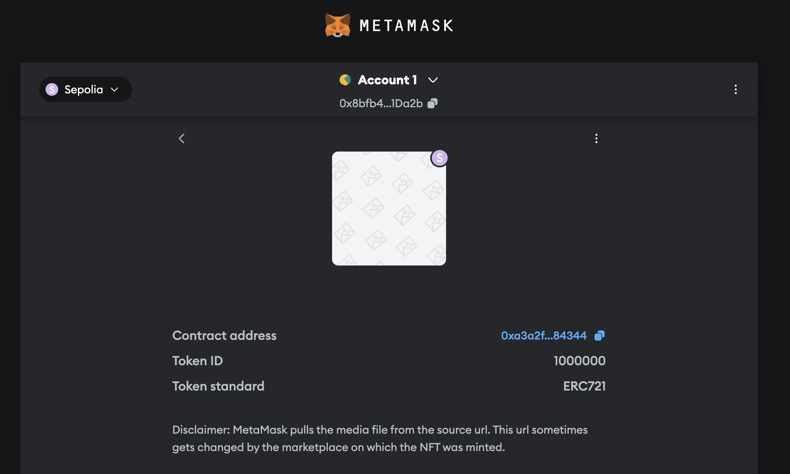

### Важное
Использовал `Foundry`, поэтому `JS`-кода совсем мало.

### Часть 1
Код всех трёх токенов лежит в папке `contracts/`, тут всё просто. Концепт Permit-ов вообще не осознал, если честно, попытался понять в процессе прикручивания, но вышло не особо(

### Часть 2
Тут стек у меня такой: `Infura`, `forge` (часть Foundry), `Etherscan`.
1. Все скрипты деплоя лежат в папке `scripts/`. Все 4 токена деплоил командой вида:
    ```bash
    forge script script/ERC20.s.sol:MatematessaTokenERC20Script --rpc-url $SEPOLIA_RPC --private-key $PRIVATE_KEY --broadcast --verify --etherscan-api-key $ETHERSCAN_API_KEY -vvvv
    ```
    (команду я дам, .env файлик я не дам)

2. Флаг `--verify` помимо деплоя запускаем верификацию конкракта.

    Ссылки на контракты:

    [ERC20](https://sepolia.etherscan.io/address/0xaf37e9be15f4b54faef081e2bb6bbad5b63fb28e)

    [ERC721](https://sepolia.etherscan.io/address/0xa3a2f1462ffed696f57ccc57a493ed294d584344)

    [ERC1155](https://sepolia.etherscan.io/address/0x809cd790db29df338bfd54c2585d7049be9bf7f8#events)

3. Показал на примере `safeMint` в файле `script/MintToken.s.sol` (но не уверен, что работает так, как должно( )

4. Вот тут не разобрался как это сделать средствами `Foundry/Solidity`, поэтому пришлось сделать это на JS.

5. А вот тут скрипт писать не пришлось! В `Foundry` изучить `storage` можно с помощью команды
    ```bash
    cast storage --rpc-url $SEPOLIA_RPC 0xa3a2f1462FFeD696F57cCc57a493eD294d584344
    ```
    , а баланс с помощью команды
    ```bash
    cast balance --rpc-url $SEPOLIA_RPC 0x8bfb4E185a58bBB4F1D5e6Be4F1da699e701Da2b
    ```

### Мат часть
1. Позволяет владельцу токенов разрешить другому адресу (например, смарт-контракту или какому-нибудь dApp) тратить определенное количество его токенов от его имени. Это нужно для делегирования контроля например, при торговле на децентрализованных криптобиржах (кажется они ещё зовутся dex), ну и в целом неплохая простая защита от случайного бага в СмК, списывающего все средства пользователей.
2. Ключевое отличие – `ERC721` работает только с non-fungible токенами, а `ERC1155` – как с fungible, так и с non-fungible токенами (и кажется оптимизирует что-то).
3. `Soulbound-токен` – токен, привязанный к сущности владельца (aka к душе), то есть его нельзя передать вообще ни на каких условиях. Отлично подходит для каких-нибудь наград, званий, сертификатов о повышении квалификации и тому подобного.
4. Кажется, достаточно заблокировать методы, отвечающие за передачу токена (я попробовал реализовать именно так).

### Доп часть
https://sepolia.etherscan.io/address/0x136f31d52f4ab9eaff9fc0fabf9537d934cbdd7a


### NFT
NFT залился, про метаданные не уверен, возможно просто не нашёл где они отображаются.

